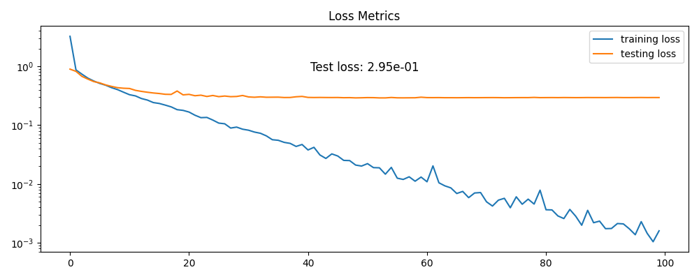
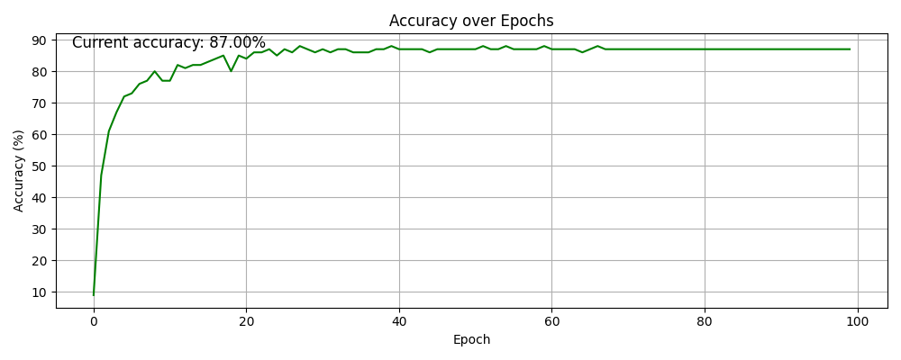

# PyTorch-wrapper: asses fast and easy your neural network

A lightweight PyTorch wrapper that can be used to fasten process of training and setting up arbitrary Neural Network to quickly test an idea/setup. The wrapper provides an interface for both standard neural networks and CNNs, but can be extended to any architecture, with built-in visualization and performance tracking capabilities. The wrapper is customizable and aims to be used on any dataset. 

## Motivation

Creating a machine learning model, or focusing on deep learning, has been greatly facilitated by libraries such as Keras, Numpy, PyTorch, Tensorflow, and many more. These libraries abstract away the complicated theory through the use of simple function calls. However, it remains a fundamental challenge for beginner programmers to create the right sequence of setting up the splitting of the training and test data, conducting the training, and finally combine all of this into a solid visualization to look how good the model is performing.

Even for experienced programmers, it takes time to write all of this down and visualize it properly. This was exactly what I experienced in my own development with Neural Networks in PyTorch. I wanted a tool to quickly test an idea, and get going with it without spending too much time on the setup itself.

As a result, I've created a PyTorch-wrapper that makes it possible to get performance metrics and import KPIs (loss, accuracy, CPU time). It decreases the overhead and allows you to focus only on the core: experimenting with the neural network.

## Features

- Easy setup of neural network architectures (both standard and CNN)
- Built-in train/test split functionality (80/20)
- Configurable training parameters via `config.py`
- Real-time visualization of:
  - Loss metrics (training, and testing loss)
  - Accuracy over epochs
  - CPU cycle time per epoch
- Support for different loss functions (LSE, CrossEntropy, or yrou custom one?)
- Reproducible results with seed setting
- Progress tracking during training

## Configuration

All network and training parameters can be configured in `config.py`. This includes:
- Network architecture (FNN or CNN)
- Network parameters (layers, neurons, etc.)
- Training parameters:
  - Batch size
  - Learning rate
  - Number of epochs

## Difference between the extended and base wrapper

There are two classes: the BasePytorchWrapper and the ExtendedPytorchWrapper. The first one includes the essential elements to accurately design and evaluate a neural network. The second one has additional features such as displaying the CPU cycles, tracking the evolution of accuracy, and setting a seed. The latter is particularly useful if you want to reproduce results and ensure consistency between different training runs.

## Output Example

The following output is an example of the output of the ExtendedPytorchWrapper. It shows the loss metrics during training, the accuracy over epochs, and the CPU time per epoch. The neural network in this case was a simple CNN with one convolutional layer (no pooling) and one fully connected layer.

  

    
    
<em>Example output showing loss metrics during training</em>

  

  

    
    
<em>Example output showing accuracy over epochs</em>

  

  

    
    
<em>Example output showing CPU cycle time per epoch</em>

  

# Installation

### Requirements
- Python 3.7+
- PyTorch 1.8+
- NumPy
- Matplotlib
- IPython (for visualization)

## Quick Start

1. Clone the repository
2. Modify `config.py` to set your desired network architecture and training parameters
3. Run `main.py` to start training

## Dataset

The data used for the example is the Sign Language Digits Dataset from the Turkey Ankara Ayrancı Anadolu High School students. This dataset is available at [ardamavi/Sign-Language-Digits-Dataset](https://github.com/ardamavi/Sign-Language-Digits-Dataset).
